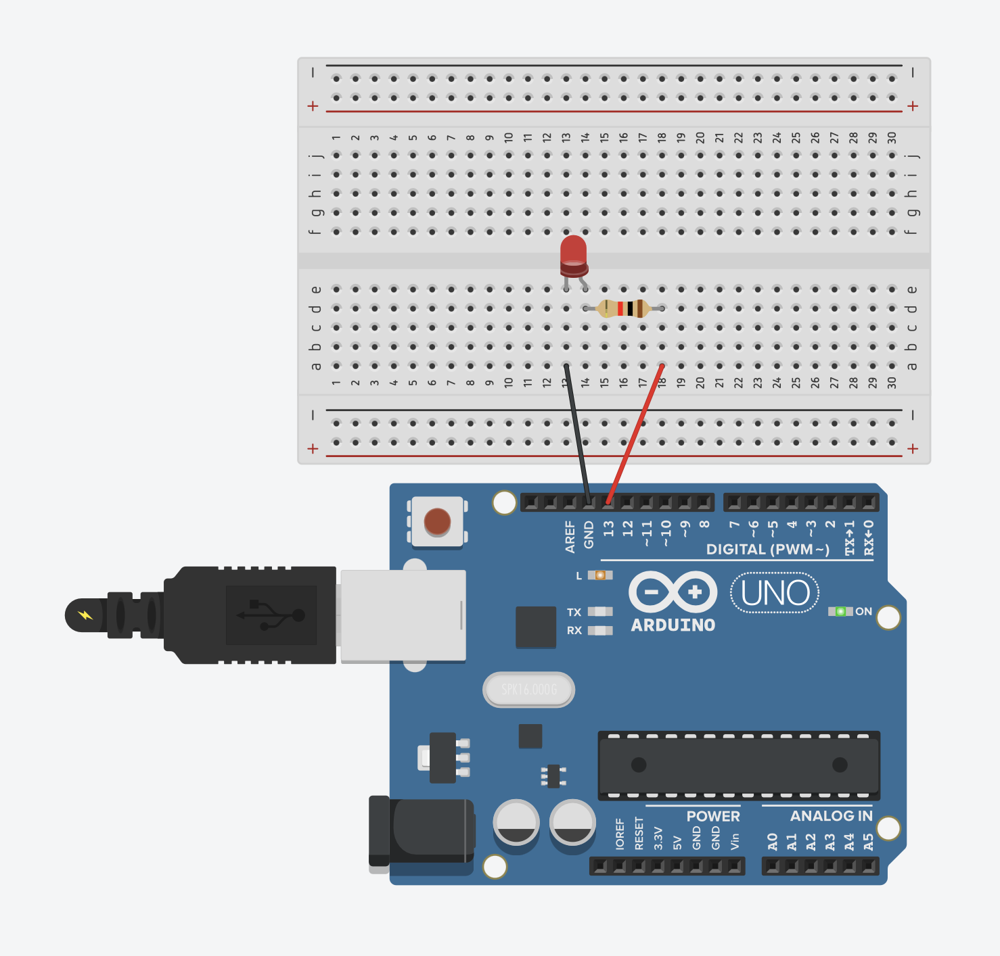
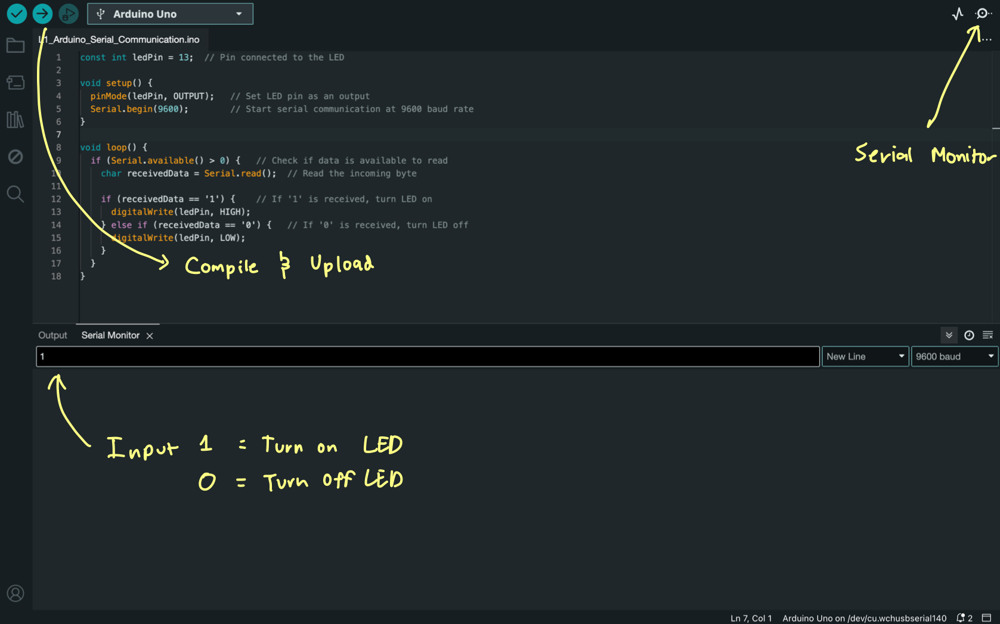

**Lesson 1: Arduino Serial Communication**

### Step 1: What is Serial Communication?

Serial communication is a way for the Arduino to communicate with your computer. It allows you to send and receive data over a USB connection. The Arduino board can send data to the computer, and the computer can send data back to the Arduino.

In this lesson, we'll:
1. Review how to use `Serial.begin()`, `Serial.read()`, and `Serial.write()` on the Arduino.
2. Send simple commands between the Arduino and your computer.

### Step 2: Arduino Code to Turn LED On/Off with Serial Monitor

1. **Basic Setup**: Let's start with an LED connected to pin 13 of the Arduino (many Arduino boards have a built-in LED on pin 13, so we'll use that for simplicity).

2. **Serial.begin()**: This function starts the serial communication between the Arduino and the computer. It needs to be in your `setup()` function.

3. **Serial.read()**: This function is used to receive data from the serial port (i.e., from your computer or Serial Monitor).

4. **Serial.write()**: This function sends data from the Arduino to the serial port.

### Arduino Code Example (/arduino/sketches/L1_Arduino_Serial_Communication):
```cpp
const int ledPin = 13;  // Pin connected to the LED

void setup() {
  pinMode(ledPin, OUTPUT);   // Set LED pin as an output
  Serial.begin(9600);        // Start serial communication at 9600 baud rate
}

void loop() {
  if (Serial.available() > 0) {   // Check if data is available to read
    char receivedData = Serial.read();  // Read the incoming byte

    if (receivedData == '1') {    // If '1' is received, turn LED on
      digitalWrite(ledPin, HIGH);
    } else if (receivedData == '0') {   // If '0' is received, turn LED off
      digitalWrite(ledPin, LOW);
    }
  }
}
```

<div align="center">
  
</div>


### What’s happening here?
- In the `setup()` function, we initialize serial communication with `Serial.begin(9600)`.
- The `loop()` function continuously checks if data is available to be read from the Serial Monitor using `Serial.available()`.
- If there’s data, it reads the data with `Serial.read()` and checks if it is either `'1'` (turn on LED) or `'0'` (turn off LED).
- The LED on pin 13 turns on or off depending on the command received.

### Step 3: Test It in the Arduino IDE

1. **Upload the Code**: Upload the above code to your Arduino board.
2. **Open Serial Monitor**: In the Arduino IDE, open the Serial Monitor (click on the magnifying glass icon in the top right).
3. **Set Baud Rate**: Make sure the baud rate in the Serial Monitor is set to `9600` (same as in the `Serial.begin(9600)` in your code).
4. **Send Data**: In the Serial Monitor, type `1` and press Enter to turn the LED on, or type `0` and press Enter to turn the LED off.

<div align="center">
  
</div>

### Mini Task:
- **Test Your Serial Communication**: Open the Serial Monitor, and try sending `1` to turn the LED on and `0` to turn it off. This is just a simple task to see if everything works and you can control the LED with the Serial Monitor.

---

Once you're comfortable with this, we'll move on to **Lesson 2: Python Serial Communication** where we’ll control the Arduino from a Python script. 

---
### Summary Lesson 1: Arduino Serial Communication

1. **Serial.begin()**  
   **What it does**: This function starts the communication between your Arduino and your computer (or Serial Monitor). You need to tell it how fast you want to communicate (called the "baud rate").  
   **Simple Explanation**: Think of `Serial.begin(9600)` as opening a "talking line" between your Arduino and your computer at a speed of 9600 words per second (baud rate). It's like setting up a phone call where both sides agree to talk at the same speed.

2. **Serial.read()**  
   **What it does**: This function reads incoming data from your computer or Serial Monitor (what you typed in). It can read one character at a time.  
   **Simple Explanation**: Imagine your Arduino is sitting at a desk with a notepad, waiting for someone (your computer) to write down a letter on the notepad. When you call `Serial.read()`, the Arduino reads the letter and writes it down. It’s like a "grab the first letter" function.

3. **Serial.write()**  
   **What it does**: This function sends data from the Arduino to your computer, just like `Serial.read()` reads data, but in reverse.  
   **Simple Explanation**: If `Serial.read()` is like reading a letter on a notepad, then `Serial.write()` is like sending a letter back to your computer. It's how your Arduino "talks" to your computer by sending data.

4. **Serial.available() > 0**  
   **What it does**: This checks if there is any data ready to be read. If it finds data, it returns true (or 1); otherwise, it returns false (or 0).  
   **Simple Explanation**: Before your Arduino reads the letter (with `Serial.read()`), it needs to check if there's any letter in the inbox to read. So, `Serial.available() > 0` checks if the inbox has at least one letter. If it does, Arduino goes ahead and reads it.
