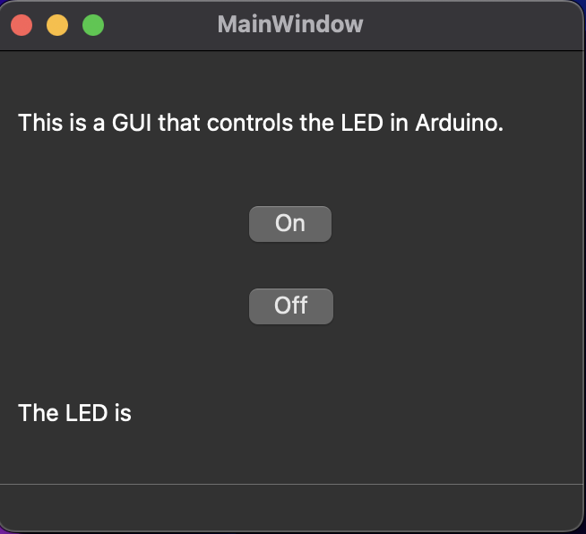

## **Lesson 3: Creating a GUI App to Control Arduino**

In this lesson, we are going to build a simple software application that allows you to control your Arduino using buttons on your computer screen. This type of application is called a **GUI**, which stands for **Graphical User Interface**. It's basically a window with buttons, labels, and other things that make it easier to control your hardware without typing commands.

To create this GUI, we are using a tool called **PySide6 Designer**. If you've never heard of it before, don't worry! PySide6 Designer is a visual tool that lets you **design your app by dragging and dropping buttons and other widgets**, instead of writing all the code by hand.

If you're new to PySide6 Designer, I highly recommend watching this free tutorial from FreeCodeCamp. It explains everything you need to know in a beginner-friendly way:  
👉 [Watch the tutorial here](https://www.youtube.com/watch?v=Z1N9JzNax2k&t=16271s)

---

### What I Designed

Here’s a quick description of the GUI I created:

<div align="center">
  
</div>

- Two buttons: **"ON"** and **"OFF"**
- A label below the buttons that shows the **current status of the LED** (for example: "LED is ON" or "LED is OFF")

This simple interface will let us click a button to turn the LED on or off, and the label will help us confirm whether our command was successfully sent to the Arduino.
Awesome, here's a cleaned-up and beginner-friendly version of that part for your PDF, with a little more explanation added:

---

### Converting the GUI Design to Python Code

Once you're done designing your GUI using **PySide6 Designer**, it saves your design as a `.ui` file. In our case, the file is saved as:

📄 `/python/gui/led_gui.ui`

This `.ui` file contains all the layout information for your GUI (like where the buttons and labels are), but it's not Python code yet. To use it in your Python project, we need to **convert** it into a `.py` file.

We do this using a command-line tool called `pyside6-uic`. This tool reads your `.ui` file and generates Python code that creates the same layout.

To convert the file, open your terminal and run this command:

```bash
pyside6-uic led_gui.ui -o led_gui.py
```

✅ This will create a new file called `led_gui.py`, which you can now import and use in your main Python program.

```python
# -*- coding: utf-8 -*-

################################################################################
## Form generated from reading UI file 'led_gui.ui'
##
## Created by: Qt User Interface Compiler version 6.8.2
##
## WARNING! All changes made in this file will be lost when recompiling UI file!
################################################################################

from PySide6.QtCore import (QCoreApplication, QDate, QDateTime, QLocale,
    QMetaObject, QObject, QPoint, QRect,
    QSize, QTime, QUrl, Qt)
from PySide6.QtGui import (QBrush, QColor, QConicalGradient, QCursor,
    QFont, QFontDatabase, QGradient, QIcon,
    QImage, QKeySequence, QLinearGradient, QPainter,
    QPalette, QPixmap, QRadialGradient, QTransform)
from PySide6.QtWidgets import (QApplication, QHBoxLayout, QLabel, QMainWindow,
    QMenuBar, QPushButton, QSizePolicy, QSpacerItem,
    QStatusBar, QVBoxLayout, QWidget)

class Ui_MainWindow(object):
    def setupUi(self, MainWindow):
        if not MainWindow.objectName():
            MainWindow.setObjectName(u"MainWindow")
        MainWindow.resize(328, 269)
        self.centralwidget = QWidget(MainWindow)
        self.centralwidget.setObjectName(u"centralwidget")
        self.verticalLayout_2 = QVBoxLayout(self.centralwidget)
        self.verticalLayout_2.setObjectName(u"verticalLayout_2")
        self.verticalLayout = QVBoxLayout()
        self.verticalLayout.setObjectName(u"verticalLayout")
        self.label = QLabel(self.centralwidget)
        self.label.setObjectName(u"label")

        self.verticalLayout.addWidget(self.label)

        self.horizontalLayout = QHBoxLayout()
        self.horizontalLayout.setObjectName(u"horizontalLayout")
        self.horizontalSpacer = QSpacerItem(40, 20, QSizePolicy.Policy.Expanding, QSizePolicy.Policy.Minimum)

        self.horizontalLayout.addItem(self.horizontalSpacer)

        self.on_button = QPushButton(self.centralwidget)
        self.on_button.setObjectName(u"on_button")

        self.horizontalLayout.addWidget(self.on_button)

        self.horizontalSpacer_2 = QSpacerItem(40, 20, QSizePolicy.Policy.Expanding, QSizePolicy.Policy.Minimum)

        self.horizontalLayout.addItem(self.horizontalSpacer_2)


        self.verticalLayout.addLayout(self.horizontalLayout)

        self.horizontalLayout_2 = QHBoxLayout()
        self.horizontalLayout_2.setObjectName(u"horizontalLayout_2")
        self.horizontalSpacer_4 = QSpacerItem(40, 20, QSizePolicy.Policy.Expanding, QSizePolicy.Policy.Minimum)

        self.horizontalLayout_2.addItem(self.horizontalSpacer_4)

        self.off_button = QPushButton(self.centralwidget)
        self.off_button.setObjectName(u"off_button")

        self.horizontalLayout_2.addWidget(self.off_button)

        self.horizontalSpacer_3 = QSpacerItem(40, 20, QSizePolicy.Policy.Expanding, QSizePolicy.Policy.Minimum)

        self.horizontalLayout_2.addItem(self.horizontalSpacer_3)


        self.verticalLayout.addLayout(self.horizontalLayout_2)

        self.label_2 = QLabel(self.centralwidget)
        self.label_2.setObjectName(u"label_2")

        self.verticalLayout.addWidget(self.label_2)


        self.verticalLayout_2.addLayout(self.verticalLayout)

        MainWindow.setCentralWidget(self.centralwidget)
        self.menubar = QMenuBar(MainWindow)
        self.menubar.setObjectName(u"menubar")
        self.menubar.setGeometry(QRect(0, 0, 328, 24))
        MainWindow.setMenuBar(self.menubar)
        self.statusbar = QStatusBar(MainWindow)
        self.statusbar.setObjectName(u"statusbar")
        MainWindow.setStatusBar(self.statusbar)

        self.retranslateUi(MainWindow)
        self.on_button.clicked.connect(self.label_2.clear)
        self.off_button.clicked.connect(self.label_2.clear)

        QMetaObject.connectSlotsByName(MainWindow)
    # setupUi

    def retranslateUi(self, MainWindow):
        MainWindow.setWindowTitle(QCoreApplication.translate("MainWindow", u"MainWindow", None))
        self.label.setText(QCoreApplication.translate("MainWindow", u"This is a GUI that controls the LED in Arduino.  ", None))
        self.on_button.setText(QCoreApplication.translate("MainWindow", u"On", None))
        self.off_button.setText(QCoreApplication.translate("MainWindow", u"Off", None))
        self.label_2.setText(QCoreApplication.translate("MainWindow", u"The LED is ", None))
    # retranslateUi


```
---

### Connecting Buttons to Python Functions

Now that we’ve converted our `.ui` file into Python code, it’s time to **make the buttons actually do something**. We do this by **connecting signals** (which are like button events) to **our own Python functions**.

In our `main_led_gui.py` file, we connect the button clicks like this:

```python
# Connect the signals (no parentheses here!)
self.ui.on_button.clicked.connect(self.turn_on)
self.ui.off_button.clicked.connect(self.turn_off)
```

Here’s what’s happening:
- When the **ON** button is clicked, the `turn_on` function is called.
- When the **OFF** button is clicked, the `turn_off` function is called.

> ⚠️ **Note:** Don’t put parentheses after the function names (`self.turn_on`, not `self.turn_on()`). If you add parentheses, the function will run immediately instead of waiting for the button click.

---

### Writing the Functions to Control the Arduino

Now we define what the `turn_on` and `turn_off` functions should do. Here’s the code:

```python
def turn_on(self):
    word = 'ON'
    self.ui.label_2.setText(f"The LED is {word}")
    arduino.write(b'1')  # Send '1' to Arduino to turn the LED on

def turn_off(self):
    word = 'OFF'
    self.ui.label_2.setText(f"The LED is {word}")
    arduino.write(b'0')  # Send '0' to Arduino to turn the LED off
```

These functions:
- Update the text label on the GUI to show whether the LED is ON or OFF
- Send a signal (`b'1'` or `b'0'`) to the Arduino through the USB port

---

### How Arduino Understands This

This connects back to **Lesson 1**, where we wrote Arduino code that reads the signal from the computer:

`arduino/sketches/L1_Arduino_Serial_Communication/L1_Arduino_Serial_Communication.ino`

```cpp
char receivedData = Serial.read();  // Read the data sent from the computer

if (receivedData == '1') {
    digitalWrite(ledPin, HIGH);       // Turn LED on
    Serial.write("LED ON\n");         // Send a message back to the computer
} 
else if (receivedData == '0') {
    digitalWrite(ledPin, LOW);        // Turn LED off
    Serial.write("LED OFF\n");        // Send a message back
} 
else {
    Serial.write("Invalid Command\n"); // Handle unexpected input
}
```

So, when Python sends `'1'`, the Arduino turns the LED **on**, and when it sends `'0'`, it turns the LED **off**.

---

### Full Code: `python/gui/main_led_gui.py`

Here is the complete code for our Python GUI that controls the Arduino:

```python
from PySide6.QtWidgets import QApplication, QMainWindow
from led_gui import Ui_MainWindow  # Auto-generated from .ui file
import serial
import time

# Connect to the Arduino through the USB port
arduino = serial.Serial(port='/dev/cu.usbserial-140', baudrate=9600, timeout=1)
time.sleep(2)  # Give Arduino time to reset

class MainWindow(QMainWindow):
    def __init__(self):
        super().__init__()
        self.ui = Ui_MainWindow()
        self.ui.setupUi(self)

        # Connect the signals (no parentheses here!)
        self.ui.on_button.clicked.connect(self.turn_on)
        self.ui.off_button.clicked.connect(self.turn_off)

    def turn_on(self):
        word = 'ON'
        self.ui.label_2.setText(f"The LED is {word}")
        arduino.write(b'1')  # Send 1 to turn on

    def turn_off(self):
        word = 'OFF'
        self.ui.label_2.setText(f"The LED is {word}")
        arduino.write(b'0')  # Send 0 to turn off

# Create the app
app = QApplication([])
window = MainWindow()
window.show()
app.exec()
```

---

### ⚠️ Important: `time.sleep(2)`

This line is **very important**:

```python
time.sleep(2)
```

When you connect to the Arduino, it **automatically resets**. If you try to send data too soon, the Arduino may **miss your first message** because it's still booting up. By waiting for 2 seconds, we make sure the Arduino is ready to receive commands.

---
Sure! Here's a clear and simple summary for **Lesson 3** that you can use in your PDF:

---

## 🔍 **Lesson 3 Summary: Building a GUI App to Control Arduino**

- We used **PySide6 Designer** to visually design a GUI with:
  - An **ON** button  
  - An **OFF** button  
  - A **status label** to show whether the LED is ON or OFF  

- The design was saved as a `.ui` file:  
  📄 `/python/gui/led_gui.ui`

- We converted the `.ui` file into Python code using this command:
  ```bash
  pyside6-uic led_gui.ui -o led_gui.py
  ```

- In our main script (`main_led_gui.py`), we:
  - **Connected button signals** to custom functions (`turn_on`, `turn_off`)
  - **Updated the label text** to show the current LED status
  - **Sent data** (`'1'` or `'0'`) to the Arduino using `arduino.write()`

- The Arduino reads this data using `Serial.read()` and turns the LED ON or OFF based on the value.

- We added `time.sleep(2)` after connecting to the Arduino to give it time to reset before sending data.

✅ By the end of this lesson, we have a working Python app that can control an LED on an Arduino with a simple and clean graphical interface!

---
