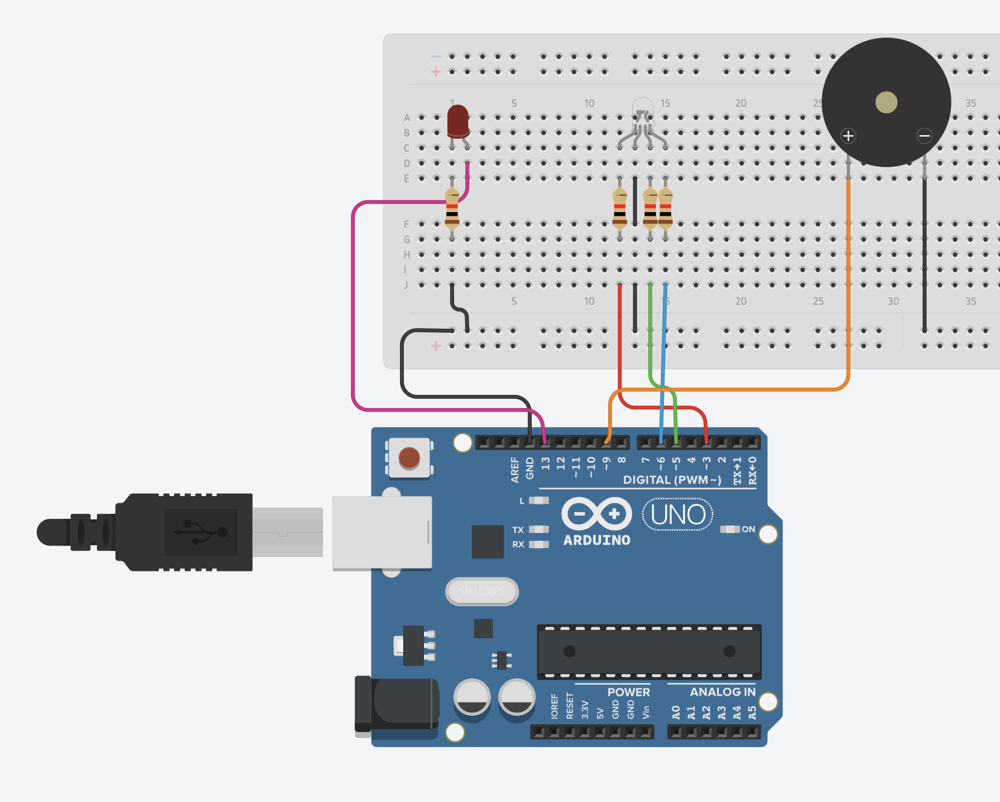

# 🧠 **Lesson 4: Extend GUI for More Controls**
**Goal:** Create a PySide6 GUI that sends commands to Arduino to:
- Toggle an LED
- Control RGB light using sliders
- Control a buzzer using a dropdown menu

---

<div align="center">
  
</div>


## 🟨 **1. Arduino Code: `led_rgb_buzzer.ino`**

📍 Save this in: `arduino/sketches/L4_extended_gui_for_more_concept/L4_extended_gui_for_more_concept.ino`

```cpp
const int led = 13;
const int r_rgb = 3;
const int g_rgb = 5;
const int b_rgb = 6;
const int buzzer = 9;

void setup() {
  pinMode(led, OUTPUT);
  pinMode(r_rgb, OUTPUT);
  pinMode(g_rgb, OUTPUT);
  pinMode(b_rgb, OUTPUT);
  pinMode(buzzer, OUTPUT);
  Serial.begin(9600);
}
```

### 🔍 Explanation:

- `pinMode(pin, OUTPUT)` – tells Arduino this pin will **send signals**, not receive them.
- `Serial.begin(9600)` – opens serial communication at **9600 bits per second** so Arduino can talk to your Python app.

---

### 📥 Receiving Commands from Python

```cpp
void loop() {
  if (Serial.available() > 0){
    String data = Serial.readStringUntil('\n'); 
    delay(50); // wait a bit for full command

    Serial.print("Received: ");
    Serial.println(data);
```

#### 🧠 Key Concepts:

- `Serial.available() > 0` → checks if there's any message from Python.
- `Serial.readStringUntil('\n')` → reads the whole line (until a new line `\n`). We use this so Arduino knows the message is complete.
- `data` → this string could be:  
  - `"LED,on"`  
  - `"RGB,255,100,0"`  
  - `"BUZ,alarm"`

---

### 💡 LED Control

```cpp
    if (data == "LED,on") {
      digitalWrite(led, HIGH);
    }
    else if(data == "LED,off"){
      digitalWrite(led, LOW);
    }
```

- `digitalWrite(led, HIGH)` → turn LED **on**
- `digitalWrite(led, LOW)` → turn LED **off**

---

### 🌈 RGB LED Control

```cpp
    int r, g, b;
    if (data.startsWith("RGB")){
      int first_comma = data.indexOf(',');
      int second_comma = data.indexOf(',', first_comma + 1);
      int third_comma = data.indexOf(',', second_comma + 1);

      r = data.substring(first_comma + 1, second_comma).toInt();
      g = data.substring(second_comma + 1, third_comma).toInt();
      b = data.substring(third_comma + 1).toInt();

      analogWrite(r_rgb, r);
      analogWrite(g_rgb, g);
      analogWrite(b_rgb, b);
    }
```

#### 🧠 What's Happening:

- `data.startsWith("RGB")` → this checks if the message begins with `"RGB"`  
- If yes, then we extract the numbers like this:

Say the data is:
```
RGB,255,100,50
```

1. `first_comma = indexOf(',')` → finds position of first comma  
2. `second_comma = indexOf(',', first_comma + 1)` → finds second comma  
3. `third_comma = indexOf(',', second_comma + 1)` → finds third comma

Then we grab numbers between the commas:
```cpp
r = data.substring(first_comma + 1, second_comma).toInt(); // 255
g = data.substring(second_comma + 1, third_comma).toInt(); // 100
b = data.substring(third_comma + 1).toInt();               // 50
```

💡 `.substring(start, end)` – slices a piece of the string  
💡 `.toInt()` – converts a string to a number

Then we send these values to the RGB LED:
```cpp
analogWrite(r_rgb, r); // 0–255 brightness
analogWrite(g_rgb, g);
analogWrite(b_rgb, b);
```

---

### 🔔 Buzzer Control

```cpp
    if (data.equals("BUZ,off")){
      analogWrite(buzzer, 0);
    }
    else if (data.equals("BUZ,beep")){
      beep();
    }
    else if (data.equals("BUZ,alarm")){
      analogWrite(buzzer, 255);
    }
```

- `"BUZ,off"` → turns the buzzer off
- `"BUZ,alarm"` → sends max signal to buzzer
- `"BUZ,beep"` → calls a special `beep()` function

```cpp
void beep(){
  analogWrite(buzzer, 255);
  delay(1000);
  analogWrite(buzzer, 0);
  delay(1000);
}
```

This creates a **beep-beep** effect!

---

## 🖥️ **2. PySide6 Python GUI: `lesson4_extended_gui.py`**

📍 Save this in: `python/gui/lesson4_extended_gui.py`

```python
from PySide6.QtWidgets import QApplication, QMainWindow
from extended_gui import Ui_MainWindow
import serial
import time
```

```python
arduino = serial.Serial(port='/dev/cu.usbserial-140', baudrate=9600, timeout=1)
time.sleep(2)
```

- Connects to Arduino's serial port
- `time.sleep(2)` – gives Arduino 2 seconds to reset after opening port

---

### 📦 Main GUI Window Class

```python
class MainWindow(QMainWindow):
    def __init__(self):
        super().__init__()
        self.ui = Ui_MainWindow()
        self.ui.setupUi(self)
```

---

### 🟢 LED Toggle Button

```python
self.ui.btn_led_toggle.toggled.connect(self.led_on)
```

```python
def led_on(self, checked):
    if checked:
        arduino.write(b'LED,on\n')
    else:
        arduino.write(b'LED,off\n')
```

- When you **toggle the button**, it sends `LED,on\n` or `LED,off\n`

---

### 🎨 RGB Sliders

```python
self.ui.red_scroll.valueChanged.connect(self.red)
self.ui.green_scroll.valueChanged.connect(self.green)
self.ui.blue_scroll.valueChanged.connect(self.blue)
```

```python
def red(self):
    self.red_ = self.ui.red_scroll.value()
    self.ui.red_value.display(self.red_)
    self.rgb_color(self.red_, self.green_, self.blue_)
```

Same for `green()` and `blue()`

#### ✅ `rgb_color()` function

```python
def rgb_color(self, r, g, b):
    cmd = f"RGB,{r},{g},{b}\n"
    arduino.write(cmd.encode())
```

### ❗Why `encode()`?

Python strings must be **encoded** into bytes before sending over serial.

- `'RGB,255,0,0\n'` → must become bytes:
```python
b'RGB,255,0,0\n'
```

So `arduino.write(cmd.encode())` is required.

---

### 🔔 Buzzer Control (Dropdown)

```python
self.ui.comboBox.currentTextChanged.connect(self.buzzer_command)

def buzzer_command(self, text):
    command = f"BUZ,{text.lower()}\n"
    arduino.write(command.encode())
```

- `text.lower()` – makes sure you send `off`, `alarm`, or `beep` in lowercase
- Sent as: `"BUZ,beep\n"` → Arduino picks this up and runs the right action

---

## ✅ Final Thoughts

You’ve learned how to:
- Build a GUI using PySide6
- Send serial commands to Arduino
- Parse complex strings with `.indexOf()` and `.substring()`
- Build a communication system using `Serial.readStringUntil('\n')`

---
Absolutely — here's a **brief summary of Lesson 4**, focusing on the **most important commands, tips, and gotchas** you should remember when building your GUI-to-Arduino app.

---

# ✅ **Lesson 4 Summary: Extend GUI with RGB + Buzzer**

---

## 🔌 **Core Idea**

Use PySide6 GUI to **control multiple components on Arduino**:
- Toggle LED
- Set RGB light colors using sliders
- Control buzzer with dropdown modes (`off`, `beep`, `alarm`)

---

## 🧠 **Important Arduino Commands**

| Command           | What it does                          |
|-------------------|---------------------------------------|
| `Serial.readStringUntil('\n')` | Reads entire line of data until newline |
| `data.startsWith("RGB")`       | Checks if data starts with `RGB`       |
| `data.indexOf(',')`            | Finds position of comma                |
| `data.substring(start, end)`   | Gets part of string (like Python slice)|
| `toInt()`                      | Converts string → int                  |
| `analogWrite(pin, value)`      | Sends PWM signal (0–255)               |
| `digitalWrite(pin, HIGH/LOW)`  | Turns digital pin on/off               |

### ✨ Pro Tip:
Use `delay(50)` after reading serial data to avoid cutting messages short.

---

## 🐍 **Important Python Concepts**

| Function / Method         | Why it's used                             |
|---------------------------|-------------------------------------------|
| `serial.Serial()`         | Connect to Arduino via USB                |
| `cmd = f"RGB,{r},{g},{b}"`| Format command string for RGB             |
| `arduino.write(cmd.encode())`| Must **encode** string to bytes         |
| `connect(signal)`         | Connect GUI actions to functions          |
| `valueChanged.connect()`  | Sliders update values live                |

---

## ⚠️ Common Mistakes to Avoid

- 🔁 **Forgetting `\n`** at end of string. Arduino reads until newline!
  ```python
  cmd = f"RGB,{r},{g},{b}\n"
  ```
- 📡 Not calling `.encode()` before writing to serial:
  ```python
  arduino.write(cmd.encode())
  ```
- 🧠 Not delaying after reading serial in Arduino:
  ```cpp
  delay(50);  // helps avoid chopped messages
  ```

---


