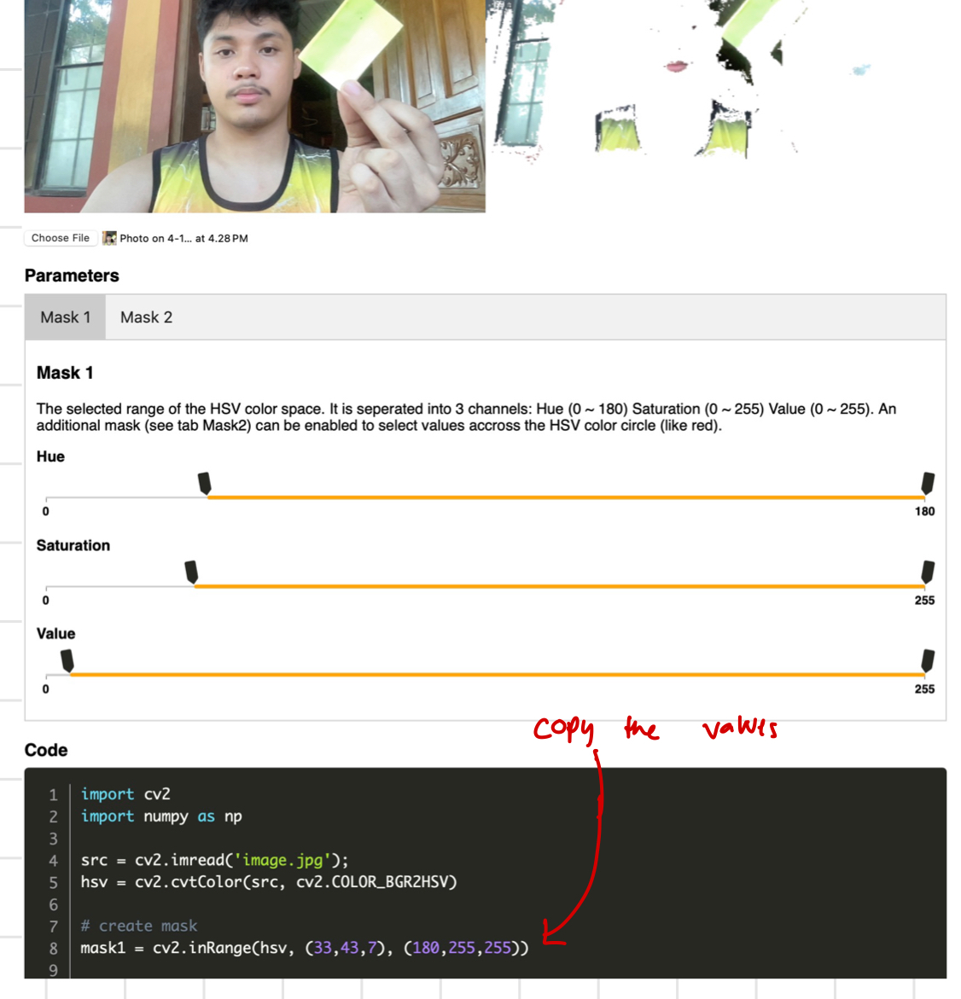

# ✅ Lesson 6 – Color Detection 

---

## 🎯 What’s the goal?

We want to detect a **specific color** (like RED 🔴) from the webcam feed, and **track it** as it moves around in real-time.

---

## 🧠 RGB vs HSV: Which is better for color detection?

### 💡 Analogy:

- **RGB/BGR** = Mixing paints manually — you get the color, but it's messy and lighting changes ruin it.
- **HSV** = Telling a robot what color you want by describing:
  - **Hue**: What color is it? (Red? Green? Blue?)
  - **Saturation**: How colorful is it?
  - **Value**: How bright is it?

🧠 HSV is way better for **color filtering** — it's like color recognition goggles 🎯

---

## 👨‍🏫 Step-by-Step Code Breakdown

---

### 🔁 Webcam Setup
```python
import cv2
import numpy as np

cap = cv2.VideoCapture(1)  # Use 0 or 1 depending on your camera
```

---

### 🎨 Step 1: Convert BGR to HSV
```python
    hsv = cv2.cvtColor(frame, cv2.COLOR_BGR2HSV)
```

This converts the camera image to **HSV format** so we can isolate colors more easily.

---

### 🟥 Step 2: Use `np.array()` to define color range

```python
    # Red has two ranges in HSV
    lower_red1 = np.array([0, 100, 100])
    upper_red1 = np.array([10, 255, 255])

    lower_red2 = np.array([160, 100, 100])
    upper_red2 = np.array([179, 255, 255])
```

### 🤔 Why `np.array()`?

- OpenCV functions expect **NumPy arrays**.
- It's **faster** because NumPy is optimized for math operations (like checking color ranges).
- It avoids bugs — using regular Python tuples can sometimes cause weird behavior.

---

**💡 Pro Tip:** Want to draw only on certain colors like red, green, or blue objects? Use HSV color masking! Go to [pseudopencv.site HSV Color Picker](https://pseudopencv.site/utilities/hsvcolormask/), pick a color, and copy the HSV range it gives you. It's perfect for tracking or highlighting specific colors in your camera feed using OpenCV!

<div align="center">
  
</div>

---

### 🪄 Step 3: Mask the red areas

```python
    mask1 = cv2.inRange(hsv, lower_red1, upper_red1)
    mask2 = cv2.inRange(hsv, lower_red2, upper_red2)
    mask = cv2.bitwise_or(mask1, mask2)
```

🧠 `cv2.inRange()` = Magic marker ✍️  
Draws **white** wherever the color matches, and **black** elsewhere.

---

### 🧼 Step 4: Filter the image
```python
    result = cv2.bitwise_and(frame, frame, mask=mask)
```

🧠 This keeps only the red parts of the frame — everything else becomes black.

---

### 👀 Step 5: Display the result
```python
    cv2.imshow("Original", frame)
    cv2.imshow("Mask", mask)
    cv2.imshow("Red Only", result)
```

---

### 🔚 Step 6: Exit on key press
```python
    if cv2.waitKey(1) & 0xFF == ord('q'):
        break

cap.release()
cv2.destroyAllWindows()
```

---

## ✅ Full Updated Code

```python
import cv2
import numpy as np

cap = cv2.VideoCapture(1)

while True:
    ret, frame = cap.read()
    if not ret:
        break

    hsv = cv2.cvtColor(frame, cv2.COLOR_BGR2HSV)

    lower_red1 = np.array([0, 100, 100])
    upper_red1 = np.array([10, 255, 255])

    lower_red2 = np.array([160, 100, 100])
    upper_red2 = np.array([179, 255, 255])

    mask1 = cv2.inRange(hsv, lower_red1, upper_red1)
    mask2 = cv2.inRange(hsv, lower_red2, upper_red2)
    mask = cv2.bitwise_or(mask1, mask2)

    result = cv2.bitwise_and(frame, frame, mask=mask)

    cv2.imshow("Original", frame)
    cv2.imshow("Mask", mask)
    cv2.imshow("Red Only", result)

    if cv2.waitKey(1) & 0xFF == ord('q'):
        break

cap.release()
cv2.destroyAllWindows()
```

---

Got it! Here's a tighter **cheat sheet** version of **Lesson 6 – Color Detection**:

---

### ✅ Lesson 6 Summary

### 🌈 Why HSV?

- **HSV** = Better for color filtering than RGB.  
  - **Hue** = Color type  
  - **Saturation** = Intensity  
  - **Value** = Brightness

---

### 🖼️ Steps

- `cv2.cvtColor(frame, cv2.COLOR_BGR2HSV)`: Convert frame to HSV.
- Define two red ranges using `np.array([H, S, V])`.
- `cv2.inRange(hsv, lower, upper)`: Create masks for red.
- `cv2.bitwise_or(mask1, mask2)`: Combine both masks.
- `cv2.bitwise_and(frame, frame, mask=mask)`: Show only red areas.

---

### 🧹 Exit

- Press `'q'` to quit.
- Call `cap.release()` and `cv2.destroyAllWindows()`.

---

### 💡 Pro Tip

Use [pseudopencv.site HSV Picker](https://pseudopencv.site/utilities/hsvcolormask/) to get HSV ranges for any color fast.
