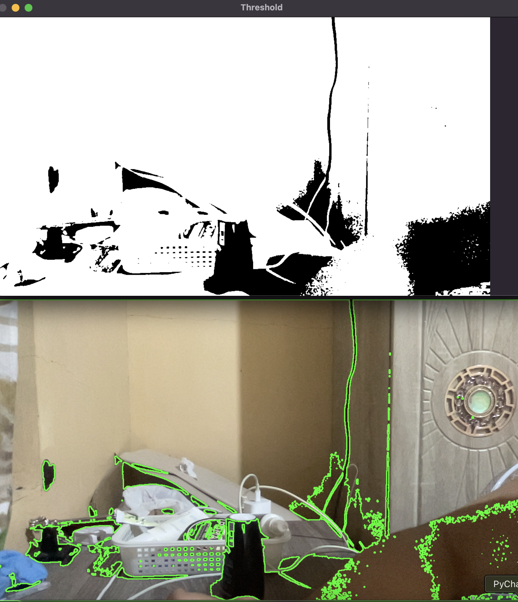

## Lesson 7.1: What is a Contour in OpenCV?

**Contours** are just **the outlines or borders of objects** in an image.

Imagine you draw the shape of your hand on paper. The line around your fingers is the **contour**.

In OpenCV, contours help us **detect shapes** — like hands, faces, circles, etc.

---

## 🔍 Why Use Contours?

- Find the shape of objects
- Count objects (like fingers ✋)
- Track movement
- Measure size/area of something

---

## 📸 Example: Webcam + Contour Detection

This code uses your **webcam**, finds objects using contours, and draws them.


### 🧑‍💻 Code with Comments `python/opencv/lesson7_1_contours.py`

```python
import cv2

# Open webcam (0 or 1 depending on your camera index)
cap = cv2.VideoCapture(1)  # You can try 0 if 1 doesn't work

while True:
    ret, frame = cap.read()
    if not ret:
        break

    # Convert to grayscale (black & white version)
    gray = cv2.cvtColor(frame, cv2.COLOR_BGR2GRAY)

    # Blur the image to reduce noise
    blurred = cv2.GaussianBlur(gray, (5, 5), 0)

    # Apply threshold to get binary image (black & white shapes)
    ret, thresh = cv2.threshold(blurred, 60, 255, cv2.THRESH_BINARY)

    # Find contours on the threshold image
    contours, _ = cv2.findContours(thresh, cv2.RETR_TREE, cv2.CHAIN_APPROX_SIMPLE)

    # Draw all contours in green
    cv2.drawContours(frame, contours, -1, (0, 255, 0), 2)

    # Show the result
    cv2.imshow("Contours", frame)
    cv2.imshow("Threshold", thresh)

    # Break on 'q' key
    if cv2.waitKey(1) & 0xFF == ord('q'):
        break

cap.release()
cv2.destroyAllWindows()
```

---

**Convert to grayscale (black & white version)**

```python
gray = cv2.cvtColor(frame, cv2.COLOR_BGR2GRAY)
```

---

### 🧠 What it does:

It **converts the color image** (`frame`) into a **grayscale** image — meaning it removes all the colors and keeps only shades of gray (from black to white). Why?

- **Contours** and most image processing steps don’t need color.
- Grayscale is **faster** and **simpler** to work with.

Parameters:

- `frame` → The original image from the webcam (in BGR format).
- `cv2.COLOR_BGR2GRAY` → Tells OpenCV to change from **BGR color** to **grayscale**.

---

#### 🎯 In short:

👉 Turns color into black & white to make processing easier and faster.

---


### 🧼 `blurred = cv2.GaussianBlur(gray, (5, 5), 0)`

This line **smooths** the image — like wiping off noise or random dots — so we get **cleaner contours**.

It uses something called a **Gaussian Blur**, which is basically a smart way of softening the image.

---

### 📦 Parameters Explained

```python
cv2.GaussianBlur(src, ksize, sigmaX)
```

- **`src`** → The input image (here: `gray`)
- **`ksize`** → **Kernel size**: A tuple that defines **how big the blur window is**
  - `(5, 5)` means a **5x5 square** is used to blur each pixel
  - Think of it like a little box that moves over the image and averages nearby pixels
  - Must be **odd numbers** like (3, 3), (5, 5), (7, 7)
- **`sigmaX`** → Standard deviation in **X direction**
  - Controls how much to blur
  - **`0`** means OpenCV **automatically calculates it** based on kernel size

---

### 🛠️ Is `(5, 5), 0` the Default?

- Not exactly the default — it's just a **commonly used value**.
- If you don't blur, contours may detect too much junk or noise.
- You can try other sizes like `(3, 3)` for less blur or `(7, 7)` for stronger blur.

---

### 🔍 Visual Example:

| Kernel Size | Effect |
|-------------|--------|
| `(3, 3)` | Slight blur, still sharp |
| `(5, 5)` | Balanced blur (used a lot) |
| `(11, 11)` | Very soft and smooth image |

---

| Part | Meaning |
|------|---------|
| `gray` | Grayscale image |
| `(5, 5)` | Blur window size (5x5 square) |
| `0` | Let OpenCV auto-set blur strength |

---


### 🧠 What This Line Does:

```python
ret, thresh = cv2.threshold(blurred, 60, 255, cv2.THRESH_BINARY)
```

It **turns a grayscale image** (which has 256 shades from black to white) **into a pure black-and-white image** — called a **binary image**.

---

### ⚙️ What Each Part Means:

| Part | Meaning |
|------|--------|
| `blurred` | The input grayscale image (from `cv2.GaussianBlur`) |
| `60` | The **threshold value** |
| `255` | The value to assign to pixels **brighter than 60** |
| `cv2.THRESH_BINARY` | This mode turns pixels into **0 or 255 only** |
| `ret` | Just a dummy return value (you can ignore it) |
| `thresh` | The resulting binary image (only black and white) |

---

### 🧪 How It Works

- Any pixel **brighter than 60** → becomes **white (255)**
- Any pixel **darker than 60** → becomes **black (0)**

So you're basically saying:

> “Hey OpenCV, make everything brighter than 60 white, and everything else black.”

---

### 📸 Why Do This?

Contour detection only works **on clear black-and-white images**.

You need this step to **simplify** the image so OpenCV can find clean shapes (like your hand, a bottle, etc.).

---

### 🔍 Visual Example

| Original (gray) | After Threshold |
|------------------|------------------|
| Hand = light gray | Hand = white |
| Background = dark | Background = black |

Now OpenCV can easily say:  
**“This white blob is a shape — let’s find the outline!”**

---

### 🧩 Here's the code:

```python
# Find contours on the threshold image
contours, _ = cv2.findContours(thresh, cv2.RETR_TREE, cv2.CHAIN_APPROX_SIMPLE)

# Draw all contours in green
cv2.drawContours(frame, contours, -1, (0, 255, 0), 2)
```

---

### 🎯 GOAL: Find the **outlines** of objects (like your hand) and **draw** them.

---

### 🕵️‍♂️ Part 1: Find Contours

```python
contours, _ = cv2.findContours(thresh, cv2.RETR_TREE, cv2.CHAIN_APPROX_SIMPLE)
```

### 🧠 Think of it like:
> “Hey OpenCV, find the shapes (outlines) in this black & white image.”

| Part | Meaning |
|------|--------|
| `thresh` | The black-and-white image |
| `cv2.RETR_TREE` | Tells OpenCV: “Find **all** the contours, even nested ones” |
| `cv2.CHAIN_APPROX_SIMPLE` | Tells OpenCV: “Don’t waste memory, give me only the **important** points of the outline” |
| `contours` | A list of all the shapes (outlines) it found — each shape is a bunch of (x, y) points! |
| `_` | A second return value we don’t care about (just a placeholder) |

---

### 🖍️ Imagine This:

You draw your hand on paper, then OpenCV gives you:
- The **line around each finger**
- As a list of points like: `[(x1, y1), (x2, y2), ...]`

That’s the **contour**!

---

### 🎨 Part 2: Draw the Contours

```python
cv2.drawContours(frame, contours, -1, (0, 255, 0), 2)
```

### 🧠 Think of it like:
> “Hey OpenCV, draw those outlines on my original image in green.”

| Part | Meaning |
|------|--------|
| `frame` | The original camera image |
| `contours` | The list of outlines |
| `-1` | Means “draw **all** the contours” |
| `(0, 255, 0)` | The color **green** (BGR format, not RGB!) |
| `2` | Thickness of the outline |

---

### 🟢 Final Result:
You see **green outlines** around everything OpenCV thinks is a shape (like your hand, bottle, face, etc.).

---

### 🧠 TL;DR:

- `findContours`: Looks for the outlines of white shapes in your image.
- `drawContours`: Draws those outlines so you can see them.

It’s like:
> 👀 “Look for shapes” → 🎨 “Draw shapes in green!”

---

<div align="center">
  
</div>

---
### 🔍Summary

| Code | Explanation |
|------|-------------|
| `cv2.VideoCapture(1)` | Opens your webcam (try 0 if 1 doesn't work) |
| `cv2.cvtColor` | Converts image to grayscale |
| `cv2.GaussianBlur` | Smooths image to remove noise |
| `cv2.threshold` | Turns grayscale into black & white shapes |
| `cv2.findContours` | Finds the outlines of the shapes |
| `cv2.drawContours` | Draws the outlines on your image |
| `cv2.imshow` | Shows the camera + contour drawing |
| `cv2.waitKey(1)` | Updates the image every frame |
| `cap.release()` | Closes webcam properly |
| `cv2.destroyAllWindows()` | Closes all windows |


