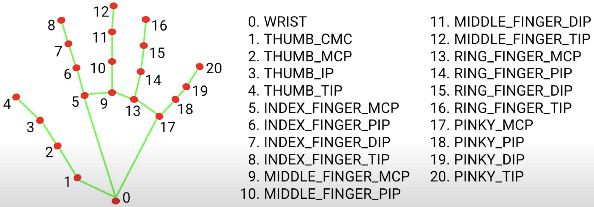

# Lesson 8: Advance Hand Tracking

## 🧠 Step 1: Hand Landmarks 

When MediaPipe "sees" your hand, it puts **21 invisible dots** (called landmarks) on your hand.

These dots have:
- A number (like Dot #0, Dot #1, Dot #2… up to #20)
- A location (like where it is in the image = x, y, z)

---

### ✋ Here's what a few important dots mean:

- **Dot 0** → Your **wrist**
- **Dot 4** → Tip of your **thumb**
- **Dot 8** → Tip of your **index finger**
- **Dot 12** → Tip of your **middle finger**
- **Dot 16** → Tip of your **ring finger**
- **Dot 20** → Tip of your **pinky**

These are like the last joint of each finger!

<div align="center">
  
</div>

---

### 🧪 How to Know If a Finger is "Up"?

MediaPipe gives each landmark a `y` value (top = small number, bottom = big number). So:

- If your **finger tip (like Dot 8)** is **higher up** than its **middle joint (like Dot 6)**,
  → The finger is "UP"
- If the tip is **lower down** than the middle joint,
  → The finger is "DOWN"

So you can tell:
> “Is this finger up or curled into a fist?”  
Just by comparing two dots!

---

### ✅ Example:

For your **index finger**:
- Tip = Dot 8  
- Middle joint = Dot 6

If:
```python
landmark[8].y < landmark[6].y  # Finger tip is higher
```
Then the finger is **up**.

If:
```python
landmark[8].y > landmark[6].y # Tip is lower than the middle joint
```
Then the finger is **curled**.

---

This is the trick we use to "read your hand" and detect gestures like:
- ✋ open hand (all fingers up)
- ✊ fist (all fingers down)
- ✌️ peace sign (2 fingers up)

---

## 🧠 Step 2: Utility Function – Finger States
We want to **know which fingers are up or down**.

You hold your hand in front of the camera.  
MediaPipe gives you **21 dots** on your hand.  
We look at those dots and say:  
➡️ "Hey, is this finger sticking up or curled down?"

---

## 🔧 Here's What the Function Does (in plain words):

```python
def get_finger_states(hand_landmarks):
```
👆 This function looks at your hand and returns something like:

```python
[1, 1, 0, 0, 0]
```

Which means:
- Thumb = UP ✅
- Index = UP ✅
- Middle = DOWN ❌
- Ring = DOWN ❌
- Pinky = DOWN ❌

---

## ✋ How It Knows Which Fingers Are Up

Imagine your hand has sensors. Each finger tip has a number:

| Finger     | Tip Dot Number |
|------------|----------------|
| Thumb      | 4              |
| Index      | 8              |
| Middle     | 12             |
| Ring       | 16             |
| Pinky      | 20             |

Those numbers come from MediaPipe.

---

### 🤔 So how do we tell if a finger is up?

Let’s say:
- You're raising your index finger ☝️  
- Tip of the finger is HIGH on the screen (small y value)
- The joint of the finger is LOWER (bigger y value)

So if **tip is higher than joint**, the finger is UP.

### How does code say that?

```python
if tip.y < joint.y:
    finger is up
```

> Smaller y = higher on screen! That’s just how computer screens work.

---

## 📌 Okay, let’s now go line-by-line:

```python
fingers = []
```
Start with an empty list to store finger states (like up/down).

---

```python
# Tip ids: Thumb, Index, Middle, Ring, Pinky
tips = [4, 8, 12, 16, 20]
```
These are the numbers (IDs) for the **tips** of each finger.

**Note**: It onlt detects right hand because of the arrangement. If you want it to be left. It should be arranged like this. `tips = [20, 16, 12, 8, 4]`

---

### 🧤 Special Case: Thumb

Thumb is **weird** because it moves sideways instead of up/down.

```python
# Thumb: compare x for left/right hand (we'll assume right hand for now)
if hand_landmarks.landmark[tips[0]].x < hand_landmarks.landmark[tips[0] - 1].x:
    fingers.append(1)  # Thumb is open
else:
    fingers.append(0)
```

- If the thumb tip is more **to the left** than the joint,
- We say: **thumb is open** → add `1` to list.

Why check `.x`? Because the thumb sticks **sideways**.

---

### ☝️ The Other Fingers

Now we check the rest of the fingers:

```python
# Other fingers: compare tip.y and pip.y
for tip_id in tips[1:]:
    if hand_landmarks.landmark[tip_id].y < hand_landmarks.landmark[tip_id - 2].y:
        fingers.append(1)
    else:
        fingers.append(0)
```

This is just checking:
- Is the **tip** above the **middle joint**?
- If yes → finger is **up** → add 1
- If no → finger is **down** → add 0

For example:
- Index tip = dot 8
- Joint below = dot 6 `landmark[tip_id - 2]`
- If `dot 8.y < dot 6.y` → index finger is up

---

## ✅ In the end:

We return a list like:
```python
[1, 1, 0, 0, 0]
```

Which you can read as:
```
[thumb, index, middle, ring, pinky]
```
---

### Code for Step 2: 
```python
def get_finger_states(hand_landmarks):
    fingers = []

    # Tip ids: Thumb, Index, Middle, Ring, Pinky
    tips = [4, 8, 12, 16, 20]

    # Thumb: compare x for left/right hand (we'll assume right hand for now)
    if hand_landmarks.landmark[tips[0]].x < hand_landmarks.landmark[tips[0] - 1].x:
        fingers.append(1)  # Thumb is open
    else:
        fingers.append(0)

    # Other fingers: compare tip.y and pip.y
    for tip_id in tips[1:]:
        if hand_landmarks.landmark[tip_id].y < hand_landmarks.landmark[tip_id - 2].y:
            fingers.append(1)
        else:
            fingers.append(0)

    return fingers  # e.g. [1, 1, 0, 0, 0] for "Peace"

```

---

## 🧠 Step 3:  Map Finger States to Gestures

The `detect_gesture()` function is used to **interpret the finger states** (whether each finger is "up" or "down") and **map them to a gesture** like "Fist", "Open Palm", "Peace", or "Point."

Let’s break it down:

---

### 👆 **Finger States:**
First, you need a list of **finger states**:
- **1** means the finger is **up**.
- **0** means the finger is **down**.

So, for example:
- `[1, 0, 0, 0, 0]` means:
  - Thumb is **up**
  - Index, Middle, Ring, and Pinky are **down**

---

### 🔎 **Mapping the Finger States to Gestures**

Now, the `detect_gesture(finger_states)` function checks the **combination** of these states and **maps** them to a gesture:

```python
def detect_gesture(finger_states):
    if finger_states == [0, 0, 0, 0, 0]:
        return "Fist"  # All fingers down = Fist
    elif finger_states == [1, 1, 1, 1, 1]:
        return "Open Palm"  # All fingers up = Open Palm
    elif finger_states == [0, 1, 1, 0, 0]:
        return "Peace"  # Index + Middle up = Peace sign
    elif finger_states == [0, 1, 0, 0, 0]:
        return "Point"  # Only Index finger up = Point
    else:
        return "Unknown"  # Catch-all if it doesn't match any pattern
```

---

### 🔢 **How the Finger States Match Gestures:**

1. **Fist:**
   - `[0, 0, 0, 0, 0]` means **all fingers down** (fist).
   - No finger is raised.
   
   **Gesture:** `"Fist"`

2. **Open Palm:**
   - `[1, 1, 1, 1, 1]` means **all fingers up** (open palm).
   - Every finger is extended.
   
   **Gesture:** `"Open Palm"`

3. **Peace:**
   - `[0, 1, 1, 0, 0]` means:
     - **Thumb is down**
     - **Index and Middle fingers are up** (Peace sign).
     - **Ring and Pinky fingers are down**.
   
   **Gesture:** `"Peace"`

4. **Point:**
   - `[0, 1, 0, 0, 0]` means:
     - **Thumb is down**
     - **Index is up** (pointing).
     - **Middle, Ring, and Pinky are down**.
   
   **Gesture:** `"Point"`

---

### 💡 Why This Works:

- The `finger_states` list represents whether each finger is "up" or "down."
- The function compares the list with specific patterns that we know represent different gestures (e.g., "Fist", "Open Palm").
- If the pattern matches, it returns the corresponding gesture name (as a string).

---


## 🧪 Step 4: Combine with Your Code

Here's the full updated version: `python/opencv/lesson8_advance_hand_tracking.py`

```python
import cv2
import mediapipe as mp

# Initialize MediaPipe
mp_drawing = mp.solutions.drawing_utils
mp_hands = mp.solutions.hands

# Gesture utility
def get_finger_states(hand_landmarks):
    tips = [4, 8, 12, 16, 20]
    fingers = []

    # Thumb: check x axis
    if hand_landmarks.landmark[tips[0]].x < hand_landmarks.landmark[tips[0] - 1].x:
        fingers.append(1)
    else:
        fingers.append(0)

    # Other fingers: check y axis
    for tip_id in tips[1:]:
        if hand_landmarks.landmark[tip_id].y < hand_landmarks.landmark[tip_id - 2].y:
            fingers.append(1)
        else:
            fingers.append(0)

    return fingers

def detect_gesture(finger_states):
    if finger_states == [0, 0, 0, 0, 0]:
        return "Fist"
    elif finger_states == [1, 1, 1, 1, 1]:
        return "Open Palm"
    elif finger_states == [0, 1, 1, 0, 0]:
        return "Peace"
    elif finger_states == [0, 1, 0, 0, 0]:
        return "Point"
    else:
        return "Unknown"

# Open webcam
cap = cv2.VideoCapture(1)

with mp_hands.Hands(min_detection_confidence=0.7, min_tracking_confidence=0.5) as hands:
    while cap.isOpened():
        success, frame = cap.read()
        if not success:
            break

        # Flip and convert
        frame = cv2.flip(frame, 1)
        rgb_frame = cv2.cvtColor(frame, cv2.COLOR_BGR2RGB)

        # Process frame
        result = hands.process(rgb_frame)

        if result.multi_hand_landmarks:
            for hand_landmarks in result.multi_hand_landmarks:
                # Draw landmarks
                mp_drawing.draw_landmarks(frame, hand_landmarks, mp_hands.HAND_CONNECTIONS)

                # Detect gesture
                finger_states = get_finger_states(hand_landmarks)
                gesture = detect_gesture(finger_states)

                # Print gesture on screen
                cv2.putText(frame, f'Gesture: {gesture}', (10, 30),
                            cv2.FONT_HERSHEY_SIMPLEX, 1, (0, 255, 0), 2)

        cv2.imshow('MediaPipe Gesture', frame)

        if cv2.waitKey(1) & 0xFF == ord('q'):
            break

cap.release()
cv2.destroyAllWindows()
```
---


